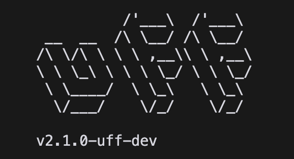

# uff - unleashed ffuf fork

<p align="center">
  
</p>

`uff` is a custom [ffuf](https://github.com/sw33tLie/uff) fork that relies on modified net/http and net/url libraries to go beyond what regular ffuf can do.

It also maintains full compatibility with regular ffuf syntax, effectively acting as a drop-in replacement.

## Installation

To install `uff`, run the following command:

```bash
go install github.com/sw33tLie/uff/v2@latest
```

## Features List

- Real raw-request fuzzing (just like in Burp Suite or Caido - see the example below)
- Absolute URI fuzzing (-opaque flag)
- No HTTP Header canonization (your header won't be capitalized by default - this can bypass some WAFs)
- Malformed HTTP headers are allowed (e.g.: headers starting with a space or without a colon)
- `-no-content-length` flag to send a body in a request even without a `Content-Length` header.
- `-request` flag actually sends the request you have in your file as it is, without reordering headers, missing malformed bits, etc.

## Other changes
- Default user agent changed to latest's Chrome version. NOTE: ffuf's default user agent is banned by many WAFs.
- Default threads increased to 200.

## Examples

### Absolute URI FUZZING:

`echo hi | uff -c -u http://example.com -w - -opaque "http://127.0.0.1/FUZZ"`
 
Sent request:

```http
GET http://127.0.0.1/hi HTTP/1.1
Host: n8wg13dfjmzknl3q6ehpd4b25tbrzhn6.oastify.com
User-Agent: Mozilla/5.0 (Macintosh; Intel Mac OS X 10_15_7) AppleWebKit/537.36 (KHTML, like Gecko) Chrome/136.0.0.0 Safari/537.36
Accept-Encoding: gzip


```

Absolute URI fuzzing is often valuable, but not supported in regular ffuf.

### Invalid header:

`echo "hi" | uff -c -u http://example.com/FUZZ -w - -H '   I AM AN INVALID: HEADER'`

```http
GET /hi HTTP/1.1
Host: n8wg13dfjmzknl3q6ehpd4b25tbrzhn6.oastify.com
User-Agent: Mozilla/5.0 (Macintosh; Intel Mac OS X 10_15_7) AppleWebKit/537.36 (KHTML, like Gecko) Chrome/136.0.0.0 Safari/537.36
   I AM AN INVALID: HEADER
Accept-Encoding: gzip


```

This allows all sorts of malformed headers.
You can even have one without a colon!

### No header canonization

`echo hi | uff -c -u http://example.com/FUZZ -w - -H 'lowercase-header: yes'`

```http
GET /hi HTTP/1.1
Host: n8wg13dfjmzknl3q6ehpd4b25tbrzhn6.oastify.com
User-Agent: Mozilla/5.0 (Macintosh; Intel Mac OS X 10_15_7) AppleWebKit/537.36 (KHTML, like Gecko) Chrome/136.0.0.0 Safari/537.36
lowercase-header: yes
Accept-Encoding: gzip


```

Note how `lowercase-header` starts with a lowercase `l`.

### Abusing the HTTP method for total control of the first request line

```
echo "hi" | uff -u "http://1y0urh3t90pydzt4ws733i1gv71zppde.oastify.com/" -w - -X "GET /FUZZ HTTP/1.0
x: x"
```

```http
GET /hi HTTP/1.0
x: x / HTTP/1.1
Host: 1y0urh3t90pydzt4ws733i1gv71zppde.oastify.com
User-Agent: Mozilla/5.0 (Macintosh; Intel Mac OS X 10_15_7) AppleWebKit/537.36 (KHTML, like Gecko) Chrome/136.0.0.0 Safari/537.36
Accept-Encoding: gzip


```

Note how the first line `GET /hi HTTP/1.0` is actually part of the HTTP method, but we can fuzz it!!!
In this example we're sending an `HTTP/1.0` request, something you can't do with regular ffuf.

Lots of things suddently become possible :)

Want to fuzz the HTTP version for some weird reason? Yeah, you can do that now.

But WAIT, there's more!

## Full raw request fuzzing with ffuf

```
echo "hi" | uff -u "http://pb4i45ghmo2mqn6s9gkrg6e48veo2eq3.oastify.com/" --method-as-raw-request -w -  -c  -X $'GET /FUZZ HTTP/0.9\r\nHost: {HOST}\r\n look im just a raw request lol \r\n   so raw\r\n\r\n' 
```

Received request:

```
GET /hi HTTP/0.9
Host: pb4i45ghmo2mqn6s9gkrg6e48veo2eq3.oastify.com
 look im just a raw request lol 
   so raw


```

The `--method-as-raw-request` makes the net/http lib only write the HTTP method in its requests.
By putting the whole raw request in the HTTP method, we achieve REAL raw-request fuzzing, just like you can do with Burp Suite or Caido.

Note you can use the {HOST} label inside the HTTP method to automatically replace it with the actual Host header of a request.

### -request flag

Just like in regular ffuf, you can use the `-request` flag to send a request from a file.
The difference is that uff sends the reqeust as it is, without any surprise (such as headers being reordered), and without missing important parts that are not RFC compliant.

```
echo hi | go run *.go -c -request /tmp/req.txt -u "http://7w40pn1z76n4b5rauy591ozmtdzan0bp.oastify.com" -w - -debug-log asd
```

Note that unlike in regular ffuf, the `-u` URL flag is now mandatory, as you can't technically guess where to send an HTTP request just from the Host: header.

## Version

Currently based on ffuf 2.10-dev

